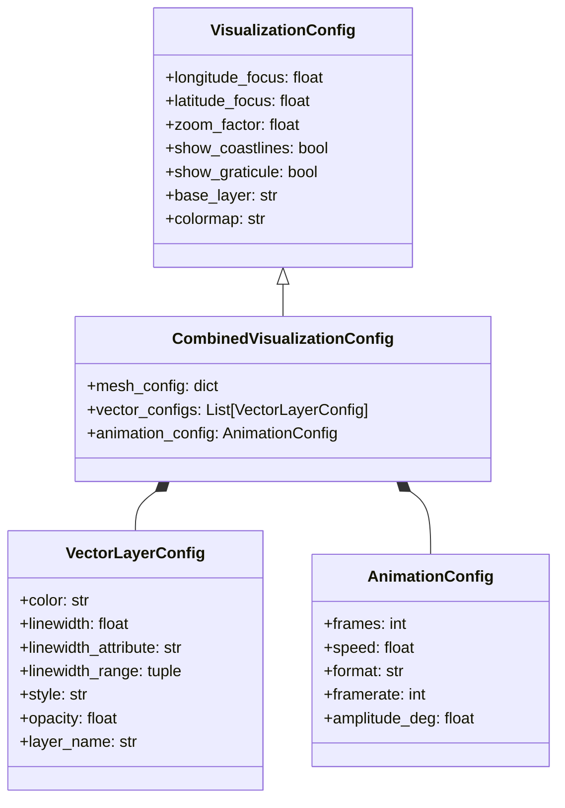

# Design Document: animate_mesh_with_vector_files Module

## Executive Summary

This document outlines the design for a new module `animate_mesh_with_vector_files.py` that combines the capabilities of:
- [`animate_polyline_file_on_sphere.py`](../pyearthviz3d/geovista/animate_polyline_file_on_sphere.py) - Vector file visualization with polylines
- [`map_single_frame.py`](../pyearthviz3d/geovista/map_single_frame.py) - Mesh-based single frame visualization

The new module will enable **animated visualizations that combine mesh data with multiple vector file overlays** (polylines, points, polygons) on a rotating 3D globe.

---

## 1. Analysis of Existing Functions

### 1.1 Core Capabilities

#### [`animate_polyline_file_on_sphere.py`](../pyearthviz3d/geovista/animate_polyline_file_on_sphere.py)
**Purpose**: Visualize vector data (polylines) from files on a 3D sphere

**Key Features**:
- Reads vector files (`.shp`, `.geojson`, `.kml`, `.gpx`) using GDAL/OGR
- Supports variable line widths based on attributes
- Creates rotating animations (MP4, GIF)
- Batch processing of multiple polylines for performance
- Camera rotation with sine-wave latitude pattern
- Geographic context (coastlines, graticule)

**Strengths**:
- Robust file I/O with coordinate transformation
- Efficient batch mesh processing
- Animation creation with PyVista movie writer
- Comprehensive error handling

**Limitations**:
- Only handles vector data (no raster/mesh support)
- No scalar field visualization
- Limited to polyline geometries
- Single file input only

#### [`map_single_frame.py`](../pyearthviz3d/geovista/map_single_frame.py)
**Purpose**: Create single-frame visualizations of mesh data with scalar fields

**Key Features**:
- Visualizes mesh objects with scalar data
- Configurable scalar bars with discrete/continuous colormaps
- Base layer support (Natural Earth, Blue Marble)
- Enhanced error handling and validation
- Detailed result reporting
- Support for mesh edges and opacity

**Strengths**:
- Rich scalar visualization capabilities
- Flexible configuration system ([`VisualizationConfig`](../pyearthviz3d/geovista/utility.py:47-171))
- Base layer integration
- Comprehensive validation

**Limitations**:
- Single frame only (no animation)
- No vector file overlay support
- Requires pre-processed mesh objects

### 1.2 Shared Infrastructure

Both functions leverage the [`utility.py`](../pyearthviz3d/geovista/utility.py) module:

**Common Components**:
- [`VisualizationConfig`](../pyearthviz3d/geovista/utility.py:47-171) - Configuration management
- [`CameraController`](../pyearthviz3d/geovista/utility.py:229-395) - Camera positioning
- [`PlotterManager`](../pyearthviz3d/geovista/utility.py:806-916) - Plotter setup with xvfb support
- [`ScalarBarConfig`](../pyearthviz3d/geovista/utility.py:397-515) - Scalar bar configuration
- [`AnimationConfig`](../pyearthviz3d/geovista/utility.py:517-666) - Animation parameters
- Geographic context functions - Coastlines, graticule, axes

---

## 2. Design Goals

### 2.1 Primary Objectives

1. **Combine Mesh + Vector Visualization**: Display mesh data with scalar fields AND vector overlays simultaneously
2. **Multiple Vector Layers**: Support multiple vector files with individual styling
3. **Animation Support**: Create rotating animations showing both mesh and vector data
4. **Flexible Input**: Support both mesh objects and vector files
5. **Backward Compatibility**: Don't break existing functions
6. **Code Reuse**: Leverage existing utility functions and patterns

### 2.2 Use Cases

**Use Case 1: Climate Model with Multiple Transportation Layers**
- Mesh: Global temperature field
- Vector Layer 1: Aircraft flight paths (red polylines)
- Vector Layer 2: Shipping routes (blue polylines)
- Vector Layer 3: Major cities (yellow points)
- Animation: Rotating view showing temperature + all transport networks

**Use Case 2: Ocean Currents with Ship Tracks and Ports**
- Mesh: Sea surface temperature
- Vector Layer 1: Historical ship trajectories (variable width by speed)
- Vector Layer 2: Port locations (points)
- Animation: Time-series showing SST evolution + maritime activity

**Use Case 3: Land Use with Infrastructure Networks**
- Mesh: Land use classification (discrete colormap)
- Vector Layer 1: Road networks (variable width by traffic)
- Vector Layer 2: Rail lines (different color)
- Vector Layer 3: Urban boundaries (polygons)
- Animation: Rotating view of land use + infrastructure

---

## 3. Unified Architecture

### 3.1 Module Structure

```
pyearthviz3d/geovista/animate_mesh_with_vector_files.py
│
├── Main Function: animate_mesh_with_vector_files()
│   ├── Input validation
│   ├── Mesh processing (optional)
│   ├── Vector files loading (multiple files)
│   ├── Plotter setup
│   ├── Mesh rendering
│   ├── Vector overlays (multiple layers)
│   ├── Animation creation
│   └── Output handling
│
├── Helper Functions:
│   ├── _load_vector_data()
│   ├── _load_multiple_vector_files()
│   ├── _add_mesh_layer()
│   ├── _add_vector_layer()
│   ├── _add_multiple_vector_layers()
│   ├── _create_animation_frames()
│   └── _validate_combined_inputs()
│
└── Configuration Classes:
    ├── CombinedVisualizationConfig (extends VisualizationConfig)
    └── VectorLayerConfig (new)
```

### 3.2 Configuration Design



---

## 4. Function Interface Design

### 4.1 Main Function Signature

```python
def animate_mesh_with_vector_files(
    # Mesh inputs (optional - can visualize vectors only)
    pMesh=None,
    aValid_cell_indices=None,
    sScalar=None,
    sUnit=None,

    # Vector inputs (optional - can visualize mesh only)
    # SUPPORTS MULTIPLE FILES: Single path string OR list of paths
    aFilename_vector_in=None,
    # SUPPORTS MULTIPLE CONFIGS: Single config OR list of configs (one per file)
    aVector_config=None,

    # Visualization configuration
    pConfig=None,

    # Animation configuration
    animation_config=None,

    # Output
    sFilename_out=None,

    # Advanced options
    style="surface",
    scalar_config=None,
    validate_inputs=True,
    return_detailed_result=False,
) -> Union[bool, AnimationResult]:
    """
    Create animated visualization combining mesh data and multiple vector file overlays.

    This function combines the capabilities of:
    - map_single_frame: Mesh visualization with scalar fields
    - animate_polyline_file_on_sphere: Vector file visualization with animation

    **NEW: Supports multiple vector files with individual styling!**

    Args:
        pMesh: GeoVista mesh object (optional if only showing vectors)
        aValid_cell_indices: Valid cell indices for mesh
        sScalar: Scalar field name to visualize on mesh
        sUnit: Unit string for scalar bar

        aFilename_vector_in: Vector file path(s). Can be:
            - Single string: "roads.shp"
            - List of strings: ["roads.shp", "rails.shp", "cities.geojson"]
        aVector_config: Vector styling configuration(s). Can be:
            - Single VectorLayerConfig: Applied to single file or all files
            - List of VectorLayerConfig: One per file (must match length)
            - None: Use default styling for all files

        pConfig: VisualizationConfig for camera, base layer, etc.
        animation_config: AnimationConfig for rotation parameters

        sFilename_out: Output file path (.mp4, .gif, .png)

        style: Mesh rendering style ('surface', 'wireframe', 'points')
        scalar_config: ScalarBarConfig for scalar bar customization
        validate_inputs: Whether to validate inputs
        return_detailed_result: Return detailed result object

    Returns:
        bool or AnimationResult: Success status or detailed result

    Examples:
        # Example 1: Mesh + Single Vector File
        >>> config = VisualizationConfig(
        ...     longitude_focus=-100, latitude_focus=40,
        ...     base_layer="blue_marble"
        ... )
        >>> animate_mesh_with_vector_files(
        ...     pMesh=temperature_mesh,
        ...     aValid_cell_indices=valid_indices,
        ...     sScalar="temperature",
        ...     sUnit="°C",
        ...     aFilename_vector_in="flight_paths.geojson",
        ...     aVector_config=VectorLayerConfig(color="red", linewidth=2.0),
        ...     pConfig=config,
        ...     sFilename_out="climate_flights.mp4"
        ... )

        # Example 2: Mesh + Multiple Vector Files with Individual Styling
        >>> vector_files = [
        ...     "roads.shp",
        ...     "rails.shp",
        ...     "cities.geojson"
        ... ]
        >>> vector_configs = [
        ...     VectorLayerConfig(color="gray", linewidth=1.0, layer_name="Roads"),
        ...     VectorLayerConfig(color="black", linewidth=2.0, layer_name="Rails"),
        ...     VectorLayerConfig(color="red", point_size=8.0, layer_name="Cities")
        ... ]
        >>> animate_mesh_with_vector_files(
        ...     pMesh=landuse_mesh,
        ...     aValid_cell_indices=valid_indices,
        ...     sScalar="landuse",
        ...     aFilename_vector_in=vector_files,
        ...     aVector_config=vector_configs,
        ...     pConfig=config,
        ...     animation_config=AnimationConfig(frames=360),
        ...     sFilename_out="landuse_transport.mp4"
        ... )

        # Example 3: Multiple Vector Files with Shared Styling
        >>> vector_files = ["track1.shp", "track2.shp", "track3.shp"]
        >>> # Single config applied to all files
        >>> shared_config = VectorLayerConfig(color="blue", linewidth=1.5)
        >>> animate_mesh_with_vector_files(
        ...     aFilename_vector_in=vector_files,
        ...     aVector_config=shared_config,  # Applied to all
        ...     pConfig=config,
        ...     sFilename_out="all_tracks.mp4"
        ... )

        # Example 4: Vector-only animation (no mesh)
        >>> animate_mesh_with_vector_files(
        ...     aFilename_vector_in=["ships.shp", "ports.geojson"],
        ...     aVector_config=[
        ...         VectorLayerConfig(color="blue", linewidth=2.0),
        ...         VectorLayerConfig(color="red", point_size=10.0)
        ...     ],
        ...     pConfig=config,
        ...     animation_config=AnimationConfig(frames=180),
        ...     sFilename_out="maritime.mp4"
        ... )

        # Example 5: Single frame with multiple layers
        >>> animate_mesh_with_vector_files(
        ...     pMesh=mesh,
        ...     aValid_cell_indices=indices,
        ...     sScalar="elevation",
        ...     aFilename_vector_in=["rivers.shp", "lakes.shp"],
        ...     aVector_config=[
        ...         VectorLayerConfig(color="blue", linewidth=1.0),
        ...         VectorLayerConfig(color="cyan", opacity=0.5)
        ...     ],
        ...     pConfig=config,
        ...     sFilename_out="terrain.png"  # Static image
        ... )
    """
```

### 4.2 VectorLayerConfig Class

```python
class VectorLayerConfig:
    """Configuration for vector layer styling."""

    def __init__(
        self,
        color: str = "royalblue",
        linewidth: float = 2.0,
        linewidth_attribute: Optional[str] = None,
        linewidth_range: Tuple[float, float] = (0.5, 3.0),
        style: str = "line",  # 'line', 'tube', 'ribbon'
        opacity: float = 1.0,
        point_size: float = 5.0,  # For point geometries
        show_points: bool = False,  # Show vertices as points
        layer_name: Optional[str] = None,  # Optional name for layer
        z_order: int = 0,  # Rendering order (higher = on top)
    ):
        """
        Initialize vector layer configuration.

        Args:
            color: Color for vector features (named color or hex code)
            linewidth: Default line width
            linewidth_attribute: Attribute name for variable width
            linewidth_range: (min, max) for width scaling
            style: Rendering style for lines
            opacity: Layer opacity (0.0 to 1.0)
            point_size: Size for point geometries
            show_points: Whether to show line vertices as points
            layer_name: Optional descriptive name for the layer
            z_order: Rendering order (higher values render on top)
        """
        self.color = color
        self.linewidth = linewidth
        self.linewidth_attribute = linewidth_attribute
        self.linewidth_range = linewidth_range
        self.style = style
        self.opacity = opacity
        self.point_size = point_size
        self.show_points = show_points
        self.layer_name = layer_name
        self.z_order = z_order

    def __repr__(self):
        name = f"'{self.layer_name}'" if self.layer_name else "unnamed"
        return f"VectorLayerConfig({name}, color={self.color}, linewidth={self.linewidth})"
```

### 4.3 AnimationResult Class

```python
class AnimationResult:
    """Result object for animation operations."""

    def __init__(
        self,
        success: bool,
        message: str = "",
        file_info: Optional[Dict[str, Any]] = None,
        animation_info: Optional[Dict[str, Any]] = None,
        layer_info: Optional[Dict[str, Any]] = None,
        system_info: Optional[Dict[str, Any]] = None,
    ):
        self.success = success
        self.message = message
        self.file_info = file_info or {}
        self.animation_info = animation_info or {}
        self.layer_info = layer_info or {}  # Info about mesh and vector layers
        self.system_info = system_info or {}

    def get_summary(self) -> str:
        """Get formatted summary of animation result."""
        if not self.success:
            return f"❌ Visualization failed: {self.message}"

        lines = ["✅ Visualization completed successfully"]

        if self.file_info:
            lines.append(f"📁 File: {self.file_info.get('filename', 'N/A')}")
            lines.append(f"📏 Size: {self.file_info.get('size_mb', 0):.2f} MB")

        if self.layer_info:
            if 'mesh' in self.layer_info:
                lines.append(f"🗺️  Mesh: {self.layer_info['mesh'].get('cells', 0)} cells")
            if 'vectors' in self.layer_info:
                n_layers = len(self.layer_info['vectors'])
                lines.append(f"📍 Vector layers: {n_layers}")
                for i, vinfo in enumerate(self.layer_info['vectors'], 1):
                    name = vinfo.get('name', f'Layer {i}')
                    features = vinfo.get('features', 0)
                    lines.append(f"   {i}. {name}: {features} features")

        if self.animation_info:
            frames = self.animation_info.get('frames', 0)
            duration = self.animation_info.get('duration', 0)
            lines.append(f"🎬 Animation: {frames} frames, {duration:.1f}s")

        return "\n".join(lines)
```

---

## 5. Implementation Strategy

### 5.1 Code Reuse Plan

**From [`animate_polyline_file_on_sphere.py`](../pyearthviz3d/geovista/animate_polyline_file_on_sphere.py)**:
- Vector file loading logic (lines 206-293)
- Batch polyline processing (lines 338-461)
- Animation frame generation (lines 710-888)
- GDAL/OGR coordinate transformation

**From [`map_single_frame.py`](../pyearthviz3d/geovista/map_single_frame.py)**:
- Mesh validation and processing (lines 136-144)
- Scalar bar configuration (lines 159-168)
- Base layer integration (lines 182-224)
- Enhanced error handling patterns

**From [`utility.py`](../pyearthviz3d/geovista/utility.py)**:
- [`PlotterManager.setup_geovista_plotter()`](../pyearthviz3d/geovista/utility.py:810-891)
- [`CameraController.calculate_animation_camera_position()`](../pyearthviz3d/geovista/utility.py:287-342)
- [`add_mesh_to_plotter()`](../pyearthviz3d/geovista/utility.py:1099-1298)
- [`add_geographic_context_enhanced()`](../pyearthviz3d/geovista/utility.py:918-1011)

### 5.2 Implementation Phases

**Phase 1: Core Structure**
1. Create module file with imports
2. Define `VectorLayerConfig` class with z_order support
3. Define `AnimationResult` class with layer info
4. Create main function skeleton with list parameter support

**Phase 2: Multiple Vector Loading**
1. Create `_normalize_vector_inputs()` to handle single/list inputs
2. Extract vector loading logic into `_load_vector_data()`
3. Create `_load_multiple_vector_files()` for batch loading
4. Support multiple geometry types (LineString, Point, Polygon)
5. Handle coordinate transformations for each file
6. Implement attribute-based styling per layer

**Phase 3: Mesh Integration**
1. Create `_add_mesh_layer()` helper
2. Integrate with existing mesh handling from [`map_single_frame.py`](../pyearthviz3d/geovista/map_single_frame.py)
3. Support optional mesh (vector-only mode)

**Phase 4: Multi-Layer Rendering**
1. Create `_add_vector_layer()` for single layer
2. Create `_add_multiple_vector_layers()` for batch rendering
3. Implement z_order sorting for proper layering
4. Handle layer naming and tracking

**Phase 5: Animation**
1. Create `_create_animation_frames()` helper
2. Integrate camera rotation logic
3. Support both animated and static output
4. Handle frame-by-frame rendering with multiple layers

**Phase 6: Testing & Documentation**
1. Create comprehensive examples with multiple layers
2. Add docstrings and type hints
3. Write unit tests for multi-file handling
4. Create usage tutorial

### 5.3 Key Implementation Details

#### Input Normalization
```python
def _normalize_vector_inputs(
    aFilename_vector_in, aVector_config
) -> Tuple[List[str], List[VectorLayerConfig]]:
    """
    Normalize vector inputs to lists.

    Handles:
    - Single file + single config
    - Single file + no config (use default)
    - List of files + single config (apply to all)
    - List of files + list of configs (one-to-one)
    - List of files + no config (use defaults)

    Returns:
        (list of file paths, list of configs)
    """
```

#### Layering Strategy
```python
# Rendering order (back to front):
1. Base layer (if specified)
2. Mesh with scalars (if provided)
3. Geographic context (coastlines, graticule)
4. Vector overlays (sorted by z_order, then by list order)
   - Layer 1 (z_order=0)
   - Layer 2 (z_order=0)
   - Layer 3 (z_order=1)  # Renders on top
5. Scalar bar and labels
```

#### Animation Frame Generation
```python
def _create_animation_frames(plotter, config, animation_config):
    """
    Generate animation frames with rotating camera.

    Process:
    1. Open movie file
    2. For each frame:
       a. Calculate camera position
       b. Update camera
       c. Render scene (all layers)
       d. Write frame
    3. Close movie file
    """
```

#### Multi-Layer Vector Processing
```python
def _add_multiple_vector_layers(
    plotter, file_paths, configs, verbose=False
) -> Dict[str, Any]:
    """
    Add multiple vector layers to plotter.

    Strategy:
    - Load each file independently
    - Apply individual styling from config
    - Sort by z_order for proper rendering
    - Track layer info for result reporting

    Returns:
        Dictionary with layer information
    """
```

---

## 6. Usage Examples

### Example 1: Climate Data with Multiple Transportation Networks

```python
import numpy as np
from pyearthviz3d.geovista.animate_mesh_with_vector_files import (
    animate_mesh_with_vector_files,
    VectorLayerConfig
)
from pyearthviz3d.geovista.utility import (
    VisualizationConfig,
    AnimationConfig,
    ScalarBarConfig
)

# Configuration
vis_config = VisualizationConfig(
    longitude_focus=0.0,
    latitude_focus=30.0,
    zoom_factor=0.7,
    base_layer="blue_marble",
    show_coastlines=True,
    show_graticule=True,
    colormap="RdYlBu_r"
)

anim_config = AnimationConfig(
    frames=360,
    speed=1.0,
    format="mp4",
    framerate=30,
    amplitude_deg=20.0
)

# Multiple vector files with individual styling
vector_files = [
    "flight_paths.geojson",
    "shipping_routes.shp",
    "major_cities.geojson"
]

vector_configs = [
    VectorLayerConfig(
        color="yellow",
        linewidth=1.5,
        opacity=0.8,
        layer_name="Air Routes",
        z_order=2  # On top
    ),
    VectorLayerConfig(
        color="cyan",
        linewidth=2.0,
        opacity=0.7,
        layer_name="Sea Routes",
        z_order=1
    ),
    VectorLayerConfig(
        color="red",
        point_size=8.0,
        opacity=1.0,
        layer_name="Cities",
        z_order=3  # Highest - on top of everything
    )
]

scalar_config = ScalarBarConfig(
    title="Temperature",
    orientation="horizontal"
)

# Create animation with mesh + 3 vector layers
result = animate_mesh_with_vector_files(
    pMesh=temperature_mesh,
    aValid_cell_indices=valid_indices,
    sScalar="temperature",
    sUnit="°C",
    aFilename_vector_in=vector_files,
    aVector_config=vector_configs,
    pConfig=vis_config,
    animation_config=anim_config,
    scalar_config=scalar_config,
    sFilename_out="climate_transport.mp4",
    return_detailed_result=True
)

print(result.get_summary())
# Output:
# ✅ Visualization completed successfully
# 📁 File: climate_transport.mp4
# 📏 Size: 45.23 MB
# 🗺️  Mesh: 50000 cells
# 📍 Vector layers: 3
#    1. Air Routes: 1250 features
#    2. Sea Routes: 850 features
#    3. Cities: 150 features
# 🎬 Animation: 360 frames, 12.0s
```

### Example 2: Multiple Vector Files with Shared Styling

```python
# Visualize multiple ship tracks with same styling
track_files = [
    "ship_track_2020.shp",
    "ship_track_2021.shp",
    "ship_track_2022.shp"
]

# Single config applied to all files
shared_config = VectorLayerConfig(
    color="blue",
    linewidth_attribute="speed",  # Variable width by speed
    linewidth_range=(0.5, 4.0),
    opacity=0.8
)

vis_config = VisualizationConfig(
    longitude_focus=-30.0,
    latitude_focus=0.0,
    base_layer="natural_earth_1",
    show_coastlines=True
)

animate_mesh_with_vector_files(
    aFilename_vector_in=track_files,
    aVector_config=shared_config,  # Applied to all 3 files
    pConfig=vis_config,
    animation_config=AnimationConfig(frames=180, speed=2.0),
    sFilename_out="ship_tracks_3years.mp4"
)
```

### Example 3: Land Use with Infrastructure (Static Frame)

```python
# Single frame: land use + roads + rails + cities
vis_config = VisualizationConfig(
    longitude_focus=-100.0,
    latitude_focus=40.0,
    zoom_factor=1.5,
    base_layer=None,
    show_coastlines=True
)

# Multiple infrastructure layers
infra_files = ["roads.shp", "railways.shp", "cities.geojson"]
infra_configs = [
    VectorLayerConfig(
        color="gray",
        linewidth_attribute="lanes",
        linewidth_range=(1.0, 5.0),
        layer_name="Roads",
        z_order=1
    ),
    VectorLayerConfig(
        color="black",
        linewidth=3.0,
        layer_name="Railways",
        z_order=2
    ),
    VectorLayerConfig(
        color="red",
        point_size=10.0,
        layer_name="Cities",
        z_order=3
    )
]

# Discrete colormap for land use
discrete_labels = {
    1: "Urban",
    2: "Agriculture",
    3: "Forest",
    4: "Water"
}
value_colors = {
    1: "#FF0000",
    2: "#FFFF00",
    3: "#00FF00",
    4: "#0000FF"
}

scalar_config = ScalarBarConfig(
    discrete_labels=discrete_labels,
    value_colors=value_colors,
    orientation="vertical"
)

animate_mesh_with_vector_files(
    pMesh=landuse_mesh,
    aValid_cell_indices=valid_indices,
    sScalar="landuse_class",
    aFilename_vector_in=infra_files,
    aVector_config=infra_configs,
    pConfig=vis_config,
    scalar_config=scalar_config,
    sFilename_out="landuse_infrastructure.png"  # Static image
)
```

### Example 4: Vector-Only with Default Styling

```python
# Quick visualization with defaults
vector_files = ["rivers.shp", "lakes.shp", "wetlands.shp"]

# No configs provided - use defaults for all
animate_mesh_with_vector_files(
    aFilename_vector_in=vector_files,
    pConfig=VisualizationConfig(
        longitude_focus=-95.0,
        latitude_focus=45.0,
        base_layer="natural_earth_hypsometric"
    ),
    sFilename_out="water_features.png"
)
```

---

## 7. Error Handling & Validation

### 7.1 Input Validation

```python
def _validate_combined_inputs(
    mesh, indices, vector_files, vector_configs, config
) -> List[str]:
    """
    Validate inputs for combined visualization.

    Checks:
    - At least one of mesh or vector_files must be provided
    - If mesh provided, indices must be valid
    - All vector files must exist and be readable
    - If vector_configs is a list, length must match vector_files
    - Configuration must be valid
    - Output format must be supported

    Returns:
        List of validation error messages (empty if all valid)
    """
```

### 7.2 Multi-File Error Recovery

1. **Individual File Failures**:
   - Skip failed files, continue with successful ones
   - Log warnings for each failure
   - Report which files were processed successfully

2. **Config Mismatch**:
   - If configs list length doesn't match files, use defaults
   - Warn user about mismatch

3. **Partial Success Handling**:
   - If some files load successfully, continue visualization
   - Report partial success in result object

---

## 8. Performance Considerations

### 8.1 Optimization Strategies

1. **Batch Processing**: Use GeoVista's multi-line support per layer
2. **Lazy Loading**: Load vector files only when needed
3. **Caching**: Cache camera positions and geometries
4. **Memory Management**: Clear unused meshes between frames
5. **Layer Sorting**: Sort by z_order once, not per frame

### 8.2 Performance Benchmarks (Estimated)

| Scenario | Frames | Mesh Cells | Vector Files | Features | Est. Time |
|----------|--------|------------|--------------|----------|-----------|
| Small | 36 | 10K | 2 | 200 | 45s |
| Medium | 180 | 50K | 3 | 2K | 5min |
| Large | 360 | 200K | 5 | 20K | 25min |

---

## 9. Testing Strategy

### 9.1 Unit Tests

- Single file vs multiple files
- Single config vs multiple configs
- Config list length validation
- Empty file list handling
- Mixed geometry types
- Z-order sorting

### 9.2 Integration Tests

- Mesh + single vector
- Mesh + multiple vectors
- Vector-only (no mesh)
- Multiple files with shared config
- Multiple files with individual configs
- Animation with multiple layers

---

## 10. Summary

### Key Design Decisions

1. ✅ **New Module**: Create separate module to avoid breaking existing code
2. ✅ **Multiple Vector Files**: Support list of file paths with individual or shared styling
3. ✅ **Flexible Configuration**: Single config applies to all, or list for individual styling
4. ✅ **Z-Order Support**: Control rendering order of vector layers
5. ✅ **Unified Interface**: Single function handles mesh, vectors, or both
6. ✅ **Code Reuse**: Leverage existing utility functions extensively

### Benefits

- **Multi-Layer Support**: Visualize multiple vector datasets simultaneously
- **Flexible Styling**: Individual or shared styling configurations
- **Layer Control**: Z-order for proper rendering hierarchy
- **Backward Compatible**: Existing functions remain unchanged
- **Extensible**: Easy to add new features

### Next Steps

1. Review and approve this design
2. Implement Phase 1 (core structure with list support)
3. Implement Phase 2 (multiple vector loading)
4. Iteratively add features through Phases 3-5
5. Create comprehensive tests and documentation
6. Release as new module in pyearthviz3d.geovista

---

**Document Version**: 2.0
**Date**: 2026-05-15
**Author**: Architecture Mode
**Status**: Ready for Review
**Changes**: Added support for multiple vector files with individual styling